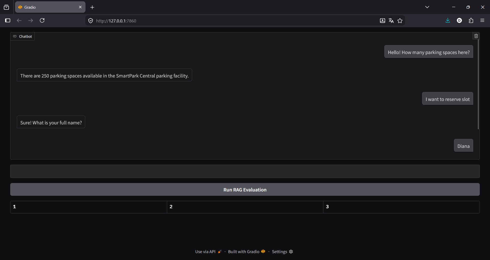
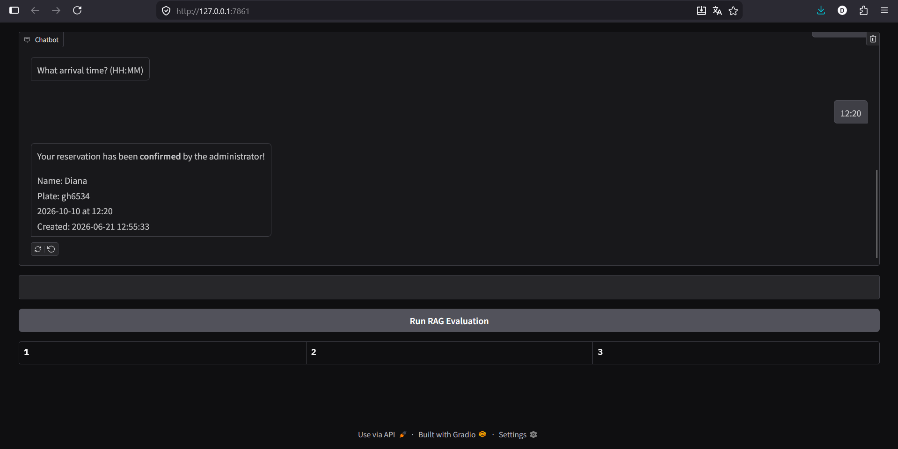
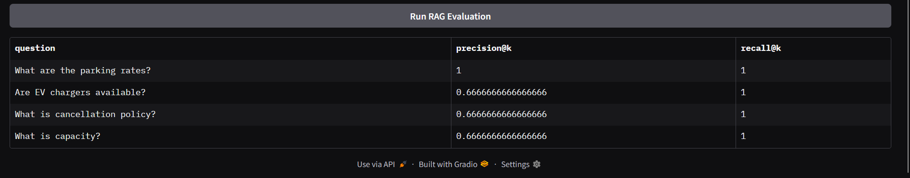
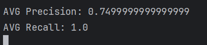

# Chatbot for Parking Space Reservation

A Retrieval-Augmented Generation (RAG) chatbot that can interact with users, provide information about parking spaces, handle the reservation process, and involve a human administrator for confirmation ("human-in-the-loop"). 
## Features

### Information Retrieval (RAG)

- Answers user questions using information stored in a vector database.
- Uses semantic search with embeddings.
- Restricts responses to retrieved knowledge to reduce hallucinations.

### Reservation Management

- Create parking reservations through a conversational interface.
- Reservation request is escalated to the human administrator after collecting details from the user.
- The server processes reservation data and saves it in storage.

### Guard Rails

- Filters unsafe or toxic user inputs using a pre-trained NLP model.
- Blocks unsafe responses generated by the language model.
- Helps prevent exposure of inappropriate content.

### Evaluation

- Measures retrieval performance using:
  - Recall@K
  - Precision@K
- Generates evaluation reports using Evidently AI.

---

## Technology Stack

- Python
- LangChain
- LangGraph
- ChromaDB
- Hugging Face API
- SQLite
- Gradio
- Evidently AI
- FastAPI
- FactMCP

---

## Project Structure

```text
Chatbot-for-Parking-Space-Reservation/
│
├── app/
│   ├── reservations/
│       └── reservations.db
│   ├── guardrails.py
│   ├── ingest_database.py
│   └── reservations.py
│
├── chroma_db/   
│
├── data/
│   └── parking_information.pdf
│
├── orchestrating/
│   ├── parking_graph.py
│   └── langgraph.json
│
├── admin_agent.py
├── admin_api.py
├── chatbot.py
├── mcp_textlog.py
├── reservations.txt
├── .env
├── requirements.txt
└── README.md
```

---

## Installation

Clone the repository:

```bash
git clone https://github.com/dinnterr/Chatbot-for-Parking-Space-Reservation.git
cd Chatbot-for-Parking-Space-Reservation
```

Create a virtual environment:

```bash
python -m venv .venv
```

Activate the environment:

### Windows

```bash
.venv\Scripts\activate
```

### Linux/macOS

```bash
source .venv/bin/activate
```

Install dependencies:

```bash
pip install -r requirements.txt
```

---

## Configuration

Create a `.env` file in the project root:

```env
LANGSMITH_API_KEY=your_key_here
LANGSMITH_TRACING="true"
HUGGINGFACEHUB_API_TOKEN=your_token_here
DB_PATH =YOUR_PATH
DATA_PATH =YOUR_PATH
CHROMA_PATH = YOUR_PATH
MCP_API_KEY=YOUR_SECURE_KEY
```

---

## Building the Vector Database

Place your parking-related PDF files in the `data` directory.

Run:

```bash
python app/ingest_database.py
```

This will:

- Load PDF documents
- Split documents into chunks
- Generate embeddings
- Store vectors in ChromaDB

### Run the Admin API
The **Admin Agent** requires the **Admin API** to handle reservation escalations and communications with the human admin. Start the Admin API:

```bash
uvicorn admin_api:app --reload
```
### Run the MCP Server
The **MCP Server** is responsible for securely saving approved reservation details into the `reservations.txt` file. Run the MCP Server:

```bash
python mcp_textlog.py
```

---

## Running the Chatbot

```bash
python app/chatbot.py
```

The Gradio user-interface will be available at:

```text
http://127.0.0.1:7861
```

---

## Example Questions (RAG)

```text
What are the parking rates?
Is overnight parking available?
Are electric vehicle chargers free?
How many parking spaces are available?
```

---

## Creating a Reservation

Start the reservation process:

```text
reserve
```

The chatbot will ask for:

1. Full name
2. License plate number
3. Reservation date
4. Arrival time

Example of process:

```text
User: reserve

Bot: What is your full name?

User: Diana Terzi

Bot: Please provide your license plate number.

User: BH1234AA

Bot: What date would you like to reserve?

User: 2026-06-15

Bot: What arrival time?

User: 10:00

Bot: Reservation confirmed!
```


## 1. Chatbot Agent Logic

The **Chatbot Agent** serves as the main point of interaction for users. It handles user queries, guides them through the reservation process, and coordinates with the **Admin Agent** to complete the process.

### Responsibilities:
1. **User Interaction**:
   - Accepts user inputs for general parking queries or reservation requests.
   - Provides parking-related information:
     - Availability, location, prices, and working hours.
     - Supports dynamic queries using Retrieval-Augmented Generation (RAG).
   - If the user initiates a reservation process, the chatbot collects:
     - Full name
     - Car number
     - Reservation period (date and time)

2. **Data Retrieval**:
   - Retrieves information from a **Vector Store** (ChromaDB).
   - Produces consistent and accurate responses by using embeddings with semantic search.

3. **Reservation Escalation**:
   - Sends reservation details to the **Admin Agent** via a REST API for human confirmation.
   - Waits for a structured response from the **Admin Agent**.

4. **Guard Rails**:
   - Uses a pre-trained NLP model to detect and block:
     - Sensitive or toxic inputs from users.
     - Unsafe responses that expose private or inappropriate data.
   - Ensures compliance with safety requirements.

5. **State Management**:
   - Tracks the **reservation state** at every step:
     - Pending, confirmed, or rejected.
   - Ensures logical handling of reservations through state transitions.

6. **Interactive Messaging**:
   - Upon admin response:
     - Notifies users of the reservation outcome (confirmed/rejected).
     - If confirmed, provides a summary of the approved reservation.

---

## 2. Admin Agent Logic

The **Admin Agent** acts as a bridge between the automated system and the **human admin**, ensuring that reservations are manually reviewed for approval or rejection.

### Responsibilities:
1. **Reservation Handling**:
   - Receives reservation details from the chatbot via a REST API:
     - Inputs include user name, car number, reservation period, etc.

2. **Admin Request Generation**:
   - Constructs a professional and structured request for the human admin.
   - Sends the request via rest api.

3. **Processing Admin Response**:
   - Waits for and processes free-text responses from the human admin.
   - Ensures responses are converted into a standardized JSON format with:
     - **Status**: `confirmed` or `rejected`.
     - **Details**: Any additional reasoning or notes provided by the admin.
   - Handles errors in responses (e.g., unclear or invalid input) by generating retry prompts.

4. **Feedback to Chatbot**:
   - Sends the processed response back to the chatbot.
   - Ensures that the response is actionable, enabling the chatbot to notify the user.

5. **Integration with System Pipeline**:
   - If the reservation is confirmed:
     - Escalates details for storage in the **SQLite database**.
     - Triggers the **MCP Server** for additional logging in text format.

---

## 3. MCP Server Logic

The **MCP Server** processes confirmed reservations and writes them to a secure text file. It ensures stability, security, and compatibility with the system pipeline.

### Responsibilities:
1. **Reservation Data Processing**:
   - Receives confirmed reservation details from the **Admin Agent**.
   - Typical inputs:
     - `Name`
     - `Car Number`
     - `Reservation Period`
     - `Approval Time`

2. **File Writing**:
   - Formats reservation records and appends them to a text file (`reservations.txt`) in the following format:
     ```
     Name | Car Number | Reservation Period | Approval Time
     ```
   - Example:
     ```
     Diana Terzi | BH1234AA | 2026-06-15 10:00 | 2026-06-12 12:34
     ```

3. **Security**:
   - Ensures that only authorized components can communicate with the server using API keys.
   - Prevents unauthorized access to or tampering with reservation data.

4. **Error Handling**:
   - Validates the received data for completeness and correctness.
   - Logs errors and exceptions during the file-writing process.

5. **Reliability**:
   - Ensures that the server is fault-tolerant and capable of handling concurrent requests.
   - Guarantees data consistency in the text file.

---

## Component Relationships

### How Components Work Together:

1. **Chatbot Agent**:
   - Acts as the entry point for users and handles general interactions as well as reservation initiation.
   - Escalates details to the **Admin Agent**.

2. **Admin Agent**:
   - Processes reservation details via the human admin.
   - Returns a decision to the chatbot for user notification.
   - Sends confirmed reservations to the **MCP Server**.

3. **MCP Server**:
   - Logs confirmed reservations into a secure text file for persistence.

---

## Process Example

### Full Workflow:
1. A user interacts with the chatbot and initiates a reservation.
2. The chatbot collects user information and passes it to the **Admin Agent**.
3. The **Admin Agent** sends the reservation request to the **Human Admin** for review.
   - The human admin confirms or rejects the request.
4. The **Admin Agent** processes the admin’s response:
   - If approved, it escalates the confirmed details for storage.
5. The chatbot notifies the user of the final decision.
6. If approved:
   - The **MCP Server** writes the reservation record to the `reservations.txt` file:
    
```mermaid
    UserInput["User Input"] --> Chatbot["Chatbot (RAG-based)"]
    Chatbot --> AdminAgent["Admin Agent (REST API)"]
    AdminAgent --> HumanAdmin["Human Admin"]
    HumanAdmin --> AdminDecision["Admin Decision (confirmed/rejected)"]
    AdminDecision -->|rejected| Chatbot
    AdminDecision -->|confirmed| MCP
    MCP --> TextFile["Write to reservations.txt"]
    Chatbot --> UserInput
```

This modular system is designed to provide accurate, secure, and reliable parking reservations.

---

## Guard Rails

The chatbot includes a guard rail mechanism based on a pre-trained NLP model:

- Detects toxic user inputs.
- Blocks unsafe requests.
- Filters unsafe generated responses.

Example:

```text
Your message was blocked due to safety policy.
```

---

## Evaluation

The project supports evaluation of retrieval quality using:

- Precision@K
- Recall@K

Evaluation reports are generated using Evidently AI.

Example:



---


## Author
**Diana Terzi**

---

## License

This project is intended for educational and research purposes.